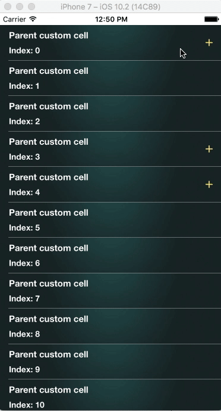

<p align="center">
  
</p>

<p align="center">
    <a href="https://twitter.com/Kiranjasvanee">
        
    </a>
    <a href="https://github.com/KiranJasvanee/KJExpandableTableTree/blob/master/LICENSE">
        
    </a>
    <a href="https://cocoapods.org/pods/KJExpandableTableTree">
        
    </a>
    <a href="http://cocoapods.org/pods/KJExpandableTableTree/">
        
    </a>
    <a href="https://github.com/KiranJasvanee/KJExpandableTableTree/issues">
        
    </a>
    <a href="https://github.com/KiranJasvanee/KJExpandableTableTree/issues">
        
    </a>
    <a href="https://github.com/KiranJasvanee/KJExpandableTableTree">
        
    </a>
    <a href="https://github.com/KiranJasvanee/KJExpandableTableTree">
        
    </a>
    <a href="https://github.com/KiranJasvanee/KJExpandableTableTree">
        
    </a>
</p>

----------------


## Preview
Expand cells in `TableView` up to ∞-1. You can use any `Custom Cell` for any `Parent`, `Childs` or their `Subchilds`    <br />   <br />

## Features
- [x] Static Initialization
- [x] Static Initialization using Index
- [x] Dynamic Initialization using JSON
- [x] Custom Cell 
- [x] Control of Cells
- [x] Fast scrolling, memory efficient

## Installation

KJExpandableTableTree is available through [CocoaPods](http://cocoapods.org). To install
it, simply add the following line to your Podfile:

```ruby
pod 'KJExpandableTableTree'
```

## Getting Started

There are ***`3 ways`*** to initialize this library.  <br /> You can choose any either way to create tree. Static/Dynamic.

#### 1 - Static Tree Initialization.
[`Example`](https://github.com/KiranJasvanee/KJExpandableTableTree/tree/master/Example_Static_Init) folder.
```swift 
// KJ Tree instances -------------------------
var arrayTree:[Parent] = []
var kjtreeInstance: KJTree = KJTree()
    
override func viewDidLoad() {
        super.viewDidLoad()
        
        // You can easily identify here, I've one parent called parent1, 3 childs inside it, 2 sub childs inside 2nd child, and 2 more sub childs inside 2nd sub child.
        // You can add as many as internal level of childs hierarchy.
        // I've provided a block of each parent and child, use this block to return no of childs [Child] inside parent/child.
        // this will provide you a robust visibility of static tree.
        let parent1 = Parent() { () -> [Child] in
            let child1 = Child()
            let child2 = Child(subChilds: { () -> [Child] in
                let subchild1 = Child()
                let subchild2 = Child(subChilds: { () -> [Child] in
                    let subchild1 = Child()
                    let subchild2 = Child()
                    return [subchild1, subchild2]
                })
                return [subchild1, subchild2]
            })
            let child3 = Child()
            
            return [child1, child2, child3]
        }
        arrayTree.append(parent1)
        kjtreeInstance = KJTree(Parents: arrayTree)
}
```
I've added 2 more parents for my demo simulation


#### 2 - Static Tree Index Initialization.

[`Example`](https://github.com/KiranJasvanee/KJExpandableTableTree/tree/master/Example_Static_Init_Using_Index) folder.

```swift 
// KJ Tree instances -------------------------
var arrayTree:[Parent] = []
var kjtreeInstance: KJTree = KJTree()

override func viewDidLoad() {
        super.viewDidLoad()
        
        // You can easily create tree by Indexing.
        // below, There will be 3 parents -
        // 1.1 indicates 1 child inside 1st parent.
        // in Second, 2nd parent have 1 child (2.1....), That 1 child have 3 subchilds (2.1.1..., 2.1.2..., 2.1.3...), now it's easy to understand 2.1.3.2 and 2.1.3.3 means 2 sub childs inside 2.1.3.
        // in Third, 3rd parent have 3 childs. 1, 2, 3.
        kjtreeInstance = KJTree(indices:
            ["1.1",
             
             "2.1.1",
             "2.1.2.1",
             "2.1.3.2",
             "2.1.3.3",
             
             
             "3.1",
             "3.2",
             "3.3"]
        )
}
```


#### 3 - Dynamic tree, using JSON - initialization.

[`Example`](https://github.com/KiranJasvanee/KJExpandableTableTree/tree/master/Example_Dynamic_Init) folder. <br />
I've used `Tree.json` file for `JSON Array`. <br />
Initialize `KJTree` with `JSON array of Parents` similar to below, Provide required Key's name and *YOUR ARE DONE*. <br />

```swift
{
    "Tree": {
        "Id": 0,
        "Parents": [
                     {
                     "Id": 1,
                     "Children": [
                                  {
                                  "Id": 2,
                                  "Children": null
                                  },
                                  {
                                  "Id": 3,
                                  "Children": [
                                               {
                                               "Id": 28,
                                               "Children": [
                                                            {
                                                            "Id": 29,
                                                            "Children": null
                                                            }
                                                            ]
                                               }
                                               ]
                                  }
                                  ]
                     },
                     {
                     "Id": 4,
                     "Children": null
                     }
                   ]
        }
}
```
```swift
// KJ Tree instances -------------------------
var arrayTree:[Parent] = []
var kjtreeInstance: KJTree = KJTree()

override func viewDidLoad() {
        super.viewDidLoad()
        
        var arrayParents: NSArray?
        if let treeDictionary = jsonDictionary?.object(forKey: "Tree") as? NSDictionary {
            if let arrayOfParents = treeDictionary.object(forKey: "Parents") as? NSArray {
                arrayParents = arrayOfParents
            }
        }
        
        if let arrayOfParents = arrayParents {
            kjtreeInstance = KJTree(parents: arrayOfParents, childrenKey: "Children", idKey: "Id")
        }
}
```

<br />
<br />

## Methods

Use `UITableView` delegates, as you guys are using, simply call library `Methods` from your delegates.

###### numberOfRowsInSection
Call `tableView(_ tableView: UITableView, numberOfRowsInSection section: Int) -> NSInteger` to return number of cells.

```swift
func tableView(_ tableView: UITableView, numberOfRowsInSection section: Int) -> Int {
        return kjtreeInstance.tableView(tableView, numberOfRowsInSection: section)
    }
```
<br />
<br />

###### cellIdentifierUsingTableView
Call `cellIdentifierUsingTableView(_ tableView: UITableView, cellForRowAt indexPath: IndexPath) -> Node` to receive `Node` instance. <br />
Use `node.index` to get index of each cell to be shown in tableview. <br />
For parents you will receive `0,1,2,...` for childs `0.0, 0.1, 0.2, 1.0, 1.1,....` for sub childs `0.0.0, 0.0.1, 0.1.0, 1.0.0, 1.1.1, ....` and so one for sub childs of sub childs you will receive `4 index separated by . (dot)` <br /> <br />
**NOTE:** You can return custom cells based on your needs, I've enclosed 3 examples to show you guys how you can return cells for different purpose. <br />
`Example_Static_Init` - Return cell by Levels. <br />
`Example_Static_Init_Using_Index` - Return cell by your assigned `Custom Index` <br />
`Example_Dynamic_Init` - cell by Levels. You can use your given identity at `node.givenIndex` or `actual index` provided by me to return different cell based on your needs. <br /> <br />

```swift
func tableView(_ tableView: UITableView, cellForRowAt indexPath: IndexPath) -> UITableViewCell {
        
        let node = kjtreeInstance.cellIdentifierUsingTableView(tableView, cellForRowAt: indexPath)
        
        // You can return different cells for Parents, childs, subchilds, .... as below.
        let indexTuples = node.index.components(separatedBy: ".")
        if indexTuples.count == 1  || indexTuples.count == 4 {
          // return cell for Parents and subchilds at level 4. (For Level-1 and Internal level-4)
        }else if indexTuples.count == 2{
          // return cell for Childs of Parents. (Level-2)
        }else if indexTuples.count == 3{
          // return cell for Subchilds of Childs inside Parent. (Level-3)
        }
        
        // Return below cell for more internal levels....
        var tableviewcell = tableView.dequeueReusableCell(withIdentifier: "cellidentity")
        if tableviewcell == nil {
          tableviewcell = UITableViewCell(style: .default, reuseIdentifier: "cellidentity")
        }
        tableviewcell?.textLabel?.text = node.index
        tableviewcell?.backgroundColor = UIColor.yellow
        tableviewcell?.selectionStyle = .none
        return tableviewcell!
}
```
<br />
<br />

###### didSelectRowAt
Call `tableView(_ tableView: UITableView, didSelectRowAt indexPath: IndexPath) -> KJExpandableTableTree.Node` to receive `Node` instance. <br />
Use `node` instance and it's `index`/`givenIndex` to verify specific cell press, to do additional task in your tableview's `didSelectRowAt`.

```swift
func tableView(_ tableView: UITableView, didSelectRowAt indexPath: IndexPath) {
        let node = kjtreeInstance.tableView(tableView, didSelectRowAt: indexPath)
        print(node.index)
        // if you've added any identifier or used indexing format
        print(node.givenIndex)
}
```

## Author

Kiran Jasvanee, kiran.jasvanee@yahoo.com

## License

KJExpandableTableTree is available under the MIT license. See the LICENSE file for more info.
